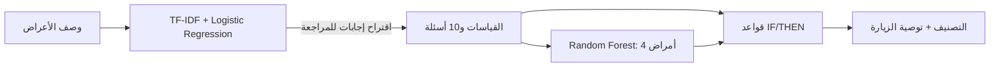

# المعمارية

| الجزء | الملف | الوظيفة |
| --- | --- | --- |
| الواجهة | `heart_app/gui.py` و`presentation.py` | شاشة واحدة وربط الأحداث وعرض النتائج |
| نموذج الأمراض | `heart_app/diagnosis.py` | التدريب والتقييم والتصنيف الرباعي |
| نموذج اللغة | `heart_app/nlp_model.py` | تدريب واستخراج حالات عشرة أعراض |
| النظام الخبير | `heart_app/triage.py` | قواعد الزيارة وأولوياتها وتفسيرها |
| تنسيق المسار | `heart_app/questionnaire.py` | التحقق وتجميع نتيجة واحدة |

النبض والضغط وSpO₂ تدخل في قواعد الفرز. نموذج الأمراض يستخدم العمر والجنس والأعراض المطابقة لخصائص DDXPlus؛ لا يدعي المشروع أن قاعدة البيانات تحتوي قياسات غير موجودة فيها.
